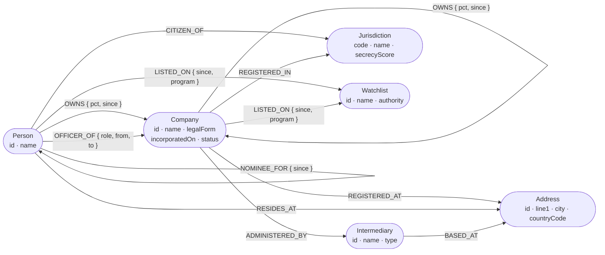

# Design the ownership graph model

Type: grilling
Status: resolved

## Question

What are the node labels, relationship types and properties of the beneficial-ownership graph?

This is the intellectual core of the submission — the assignment grades "a thoughtful graph data
model" first among the data requirements, and the seed script, the query set, the chat tool set and
the chart all read off it.

Decisions to settle, one at a time, via `/grilling` and `/domain-modeling`:

- Which entities are nodes and which are properties? `Jurisdiction` and `Address` are the interesting
  calls — a jurisdiction as a node lets you traverse "everything registered here", as a property it
  is just a filter. The same question applies to `Bank`, `Intermediary` and `Officer role`.
- Does a `Company` differ from a `Trust` / `Foundation` / `Partnership`, or is legal form a property?
- How is an ownership stake modelled? A `:OWNS` relationship carrying a percentage is the obvious
  move, but stakes have validity dates, share classes, and can be held nominee-on-behalf-of. Decide
  whether the stake needs to be reified as its own node.
- How are officers modelled — `:DIRECTOR_OF`, or one `:OFFICER_OF` with a role property?
- What are the weak-signal edges that make the "hidden connection" queries work: shared address,
  shared intermediary, shared officer? Are these stored edges or derived at query time?
- Which properties are needed for a legible UI label on every node type?
- What are the uniqueness constraints and the natural keys?

**The answer must produce:** a glossary in `CONTEXT.md` (terms only, no implementation detail) and a
Mermaid data-model diagram destined for the README.

## Answer

Six node labels, ten relationship types. Every pattern below was executed against the live CognoDB
instance before being written down — per the map's standing note, Neo4j documentation is not evidence.

### Decisions

| Question                              | Decision                                                                 | Why                                                                                                                                                                  |
| ------------------------------------- | ------------------------------------------------------------------------ | -------------------------------------------------------------------------------------------------------------------------------------------------------------------- |
| Stake shape                           | `:OWNS` relationship carrying `pct`, plus a separate `:NOMINEE_FOR` edge | Keeps the verified `reduce()` traversal working and one ownership step = one chart edge. The nominee edge adds the registered-vs-beneficial gap without reification. |
| Jurisdiction / Address / Intermediary | Nodes, not properties                                                    | These _are_ the mechanism of the hidden-link queries. As properties they degrade into string self-joins — exactly what the README argues against.                    |
| Legal form                            | Property on `:Company`                                                   | Trusts and foundations traverse identically to companies. Five labels map 1:1 onto chart categories; legal form is a badge.                                          |
| Officers                              | One `:OFFICER_OF` with a `role` property                                 | Shared-officer queries stay a single 2-hop pattern that never needs extending as roles are added.                                                                    |
| Risk                                  | `:Watchlist` node with `:LISTED_ON` edges                                | Makes "everything controlled by anyone on this list" a traversal, and gives the chart a visible hub that carries the stakes.                                         |
| Weak-signal edges                     | **Derived at query time, never materialised**                            | Follows from the node decision. A stored `:SHARES_ADDRESS_WITH` would be redundant with the 2-hop path and would go stale on every seed change.                      |

### The model



`:OWNS` is the only recursive relationship, and the only one carrying a percentage. `:NOMINEE_FOR`
targets a Person or a Company (the Principal).

### Keys, constraints, indexes — all verified created

Natural keys are deterministic ids assigned by the seed generator (`P1…`, `C1…`), not UUIDs, so the
graph is reproducible and README screenshots stay accurate.

```cypher
CREATE CONSTRAINT uniq_person       FOR (n:Person)       REQUIRE n.id   IS UNIQUE
CREATE CONSTRAINT uniq_company      FOR (n:Company)      REQUIRE n.id   IS UNIQUE
CREATE CONSTRAINT uniq_jurisdiction FOR (n:Jurisdiction) REQUIRE n.code IS UNIQUE
CREATE CONSTRAINT uniq_address      FOR (n:Address)      REQUIRE n.id   IS UNIQUE
CREATE CONSTRAINT uniq_intermediary FOR (n:Intermediary) REQUIRE n.id   IS UNIQUE
CREATE CONSTRAINT uniq_watchlist    FOR (n:Watchlist)    REQUIRE n.id   IS UNIQUE

CREATE FULLTEXT INDEX entity_search FOR (n:Person|Company|Intermediary) ON EACH [n.name]
```

Every node carries a human-readable label property for the chart: `name` on Person, Company,
Intermediary, Jurisdiction and Watchlist; `line1` on Address. UI code can use
`coalesce(n.name, n.line1)`.

Property types confirmed working: `date()`, `datetime()`, float, boolean, and list-of-string.
Multi-label is supported (`CREATE`, `MATCH` by either label, `SET`/`REMOVE`) — not used, but available.

### Signature patterns — all executed successfully against the live instance

On a 12-node fixture with a deliberate 4-layer chain, a cycle, and two "unrelated" bidders:

| Pattern                                                      | Result                                                                                     |
| ------------------------------------------------------------ | ------------------------------------------------------------------------------------------ |
| Beneficial owner of a company, 4 hops, percentages rolled up | Viktor Anand → Pelagic Ventures at **21.6%** through four layers                           |
| Circular ownership                                           | Found the `Arcadia → Meridian → Northwind → Pelagic → Arcadia` cycle, once per entry point |
| Hidden link between two bidders                              | `Bidder Alpha → PO Box 3151 → Bidder Beta`, 2 hops via `REGISTERED_AT`                     |
| Everything a watchlisted person controls                     | 4 companies, with effective percentage and depth                                           |
| Companies sharing a registered address                       | Correct                                                                                    |
| Jurisdiction secrecy exposure of an owner's portfolio        | Correct                                                                                    |
| Nominee unmasking — who is this nominee really acting for    | Correct                                                                                    |
| Full-text entity resolution                                  | `"Bidder"` → both bidders, scored                                                          |

The chart payload shape works too: the ownership subgraph for one company returned 5 nodes / 4 edges
via `nodes(p)` / `relationships(p)`, which is directly the ECharts `{nodes, links}` structure.

### Finding: hub nodes poison the hidden-link query

The shortest-path hidden-link query returned **five** 2-hop paths between the two bidders, not one.
Only one was meaningful — the shared address. The others routed through `REGISTERED_IN` — both
companies are registered in the BVI — which is true and completely uninformative, because a
jurisdiction is shared by every company in it.

`Jurisdiction` is a **Hub** (see `CONTEXT.md`), and at realistic seed volume so is a popular
`Intermediary`. Any `shortestPath((a)-[*..6]-(b))` over _all_ relationship types will preferentially
route through hubs and return noise that looks like a finding.

So the hidden-link query must constrain relationship types rather than traverse everything:

```cypher
MATCH p = shortestPath((a)-[:OWNS|OFFICER_OF|REGISTERED_AT|ADMINISTERED_BY|NOMINEE_FOR*..6]-(b))
```

`REGISTERED_IN` and `CITIZEN_OF` are excluded from link-finding — they stay in the model for filtering
and for the secrecy-exposure query, where being a hub is the point. Ticket 05 must carry this
constraint into whichever query it selects, and ticket 06 must not assume a shared jurisdiction counts
as a planted hidden link.

### Artefacts

- `CONTEXT.md` at the repo root — the glossary, implementation-free.
- The Mermaid diagram above, destined for the README verbatim.
- `<scratchpad>/probe/validate-model.mjs` — the fixture and all eight patterns, re-runnable. The
  durable version of this belongs in the repo as the query library once ticket 04 lands.

The instance was left empty; the fixture and its constraints were dropped after validation.

**Status: resolved.** Unblocks the query set, the seed generator and the UI prototype.
