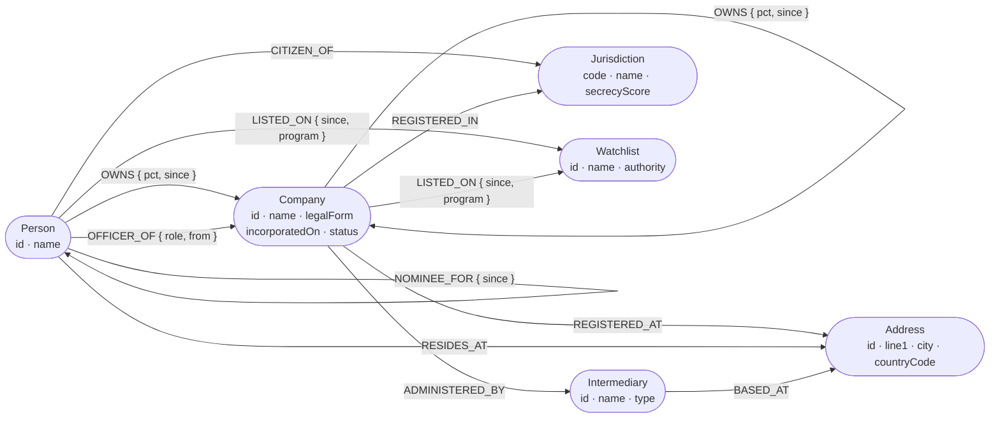

# Ownership Graph

**Who really owns this company?** A graph explorer for corporate beneficial ownership, built on
[CognoDB](https://console.cognodb.com). Ask in plain language, or click through six investigative
questions, and watch the answer draw itself.

> **Live demo:** _(pending deployment — see [Deployment](#deployment))_
> **Recording:** _(pending)_

---

## The use case

Company ownership is layered on purpose. A UK contractor is owned by a BVI holding company, which is
owned by a Cypriot partnership, which is owned by a Liechtenstein foundation, which is controlled by
one person — who never appears on any register the contractor files. The register shows a _nominee_;
the beneficial owner is four hops away.

The seeded scenario is a procurement case. Two companies bid on the **Northgate Transit Extension**.
They look unrelated — different UK addresses, different directors, ordinary `Ltd`s. They are not:

```
Konstantin Belov  (OFAC SDN · RUSSIA-EO14024)
  └─100%→ Thornbury Family Foundation (LI)
      └─85%→ Halcyon Capital Partners Ltd (CY)
          ├─90%→ Cobalt Estuary Holdings Ltd (VG) ─100%→ Meridian Civic Infrastructure  = 76.5%
          └─60%→ Orinoco Asset Management SA (PA)
                  └─70%→ Sable Quay Investments Ltd (VG) ─100%→ Harbour Line Construction = 35.7%
```

Their two offshore parents also share a registered address, a corporate agent, **and** a director —
who is herself a nominee for Belov. Three independent connections, none of which appears in either
company's own filing.

## Why a graph database?

Because every question worth asking here is about a **path**, and paths are where relational schemas
get expensive.

Take the headline query — _who ultimately owns this company, and how much?_ It is a transitive closure
over an edge table, with arithmetic accumulated along each path and summed across paths. In SQL:

```sql
WITH RECURSIVE chain(owner_id, company_id, pct, depth, visited) AS (
    SELECT owner_id, company_id, pct, 1, ARRAY[company_id]
    FROM   ownership WHERE company_id = $1
  UNION ALL
    SELECT o.owner_id, c.company_id, c.pct * o.pct, c.depth + 1, c.visited || o.company_id
    FROM   chain c
    JOIN   ownership o ON o.company_id = c.owner_id
    WHERE  c.depth < 5
      AND  NOT o.company_id = ANY(c.visited)   -- or this never terminates
)
SELECT owner_id, SUM(pct) FROM chain GROUP BY owner_id;
```

That works. It is also the point at which the schema stops being the interesting part of the problem
and starts being the obstacle: the cycle guard is manual, the depth cap is baked into the query, and
every new relationship type — officer, address, agent, nominee — needs its own recursive branch. The
same question in Cypher is one `MATCH`:

```cypher
MATCH p = (owner)-[:OWNS*1..6]->(target:Company {id: $companyId})
WITH owner, sum(reduce(acc = 1.0, r IN relationships(p) | acc * r.pct)) AS effectivePct
RETURN owner.name, effectivePct ORDER BY effectivePct DESC
```

Three specific wins, all of them load-bearing for this app:

**Unbounded traversal is the default, not an escalation.** Depth is a number in the pattern. Going
from four layers to six is a parameter, not a rewrite.

**"How are these two connected?" has no relational equivalent worth writing.** Shortest path across
_seven different relationship types_ between two arbitrary nodes is one `shortestPath()` call. In SQL
it is a recursive union over every edge table you own, and it gets worse each time you add one.

**Cycle detection is a first-class question.** Companies that own each other in a ring never reach a
natural person — that is what the structure is _for_. Finding those rings is a pattern here and a
research project in SQL.

The honest counterpoint: _"which companies share this address?"_ is a plain self-join and a graph adds
nothing. It earns its place in the app as the natural click-through, not as evidence for the argument.

## Data model

Six labels, ten relationship types. `:OWNS` is the only recursive relationship and the only one
carrying a percentage.



Three modelling decisions worth defending:

- **The percentage rides on the relationship**, not on a reified `:Stake` node. Reifying would double
  every path length and break the `reduce()` rollup that is the core of the app.
- **Address, Intermediary and Jurisdiction are nodes, not properties.** They _are_ the mechanism of
  the hidden-link queries — as string properties, "two companies share an agent" degrades into exactly
  the self-join this project argues against.
- **Legal form is a property.** A trust is owned and traversed identically to an LLC; the distinction
  is a badge, not a label.

The vocabulary used throughout the code, the UI and this document is defined in
[`CONTEXT.md`](./CONTEXT.md).

## The queries

Six signature queries plus two primitives, in [`apps/api/src/graph/queries.ts`](./apps/api/src/graph/queries.ts).

| Query                | Question                                 | Why it earns its place                                    |
| -------------------- | ---------------------------------------- | --------------------------------------------------------- |
| `beneficialOwners`   | Who really owns this company?            | 5 hops, recursive rollup with percentage arithmetic       |
| `ownershipCycles`    | Does this structure own itself?          | The hardest thing here to express relationally            |
| `hiddenLink`         | How are these two connected?             | Shortest path across seven relationship types             |
| `watchlistControl`   | What does this sanctioned party control? | Recursive traversal from a watchlist, with depth          |
| `nomineeUnmasking`   | Who is this nominee acting for?          | The gap between registered and beneficial owner           |
| `sharedRegistration` | Who else uses this address or agent?     | Reports _how many_ share it, so weak signals read as weak |
| `resolveEntity`      | Which entity does this name mean?        | Full-text lookup; the chat's first call                   |
| `neighbourhood`      | What is connected to this node?          | Click-to-expand                                           |

Every query is **fully parameterised**. Static Cypher fragments are composed from module constants to
avoid repeating a projection six times, but no value derived from a request ever enters query text.

## Notable engineering

CognoDB reports itself as `Neo4j/5.26.0` and speaks Bolt 5.4, so the official driver works unchanged —
but its Cypher surface is a reimplementation, and three differences shaped the code. All were found by
probing the live instance, because there is no way to enumerate the supported surface: `SHOW
PROCEDURES`, `SHOW DATABASES`, `db.info()` and `dbms.components()` are all unavailable.

**Variable-length paths use node uniqueness, not relationship uniqueness.** A path may not revisit a
node. So every natural phrasing of cycle detection returns **zero rows — silently**, which reads as
missing data rather than a dialect mismatch:

```cypher
MATCH p = (c)-[:OWNS*2..6]->(c)                     -- 0 rows, no error
MATCH p = (a)-[:OWNS*2..6]->(b) WHERE a = b         -- 0 rows, no error
```

The working idiom matches the closing edge separately, so no node repeats inside the expansion:

```cypher
MATCH (a:Company)-[:OWNS]->(b:Company)
MATCH p = (b)-[:OWNS*1..6]->(a)
```

**Cypher cannot parameterise a variable-length bound or a label.** This is the trap behind the
"no string-concatenated Cypher" requirement: a depth control in the UI is the obvious route to
building query strings. Instead the bound is fixed in the text at the engine ceiling and narrowed at
runtime by a parameter:

```cypher
MATCH p = (owner)-[:OWNS*1..6]->(target:Company {id: $companyId})
WHERE length(p) <= $maxDepth
```

**No APOC, no GDS.** Every query is plain Cypher.

**`OPTIONAL MATCH` does not constrain a bound target.** With both endpoints already bound,
`OPTIONAL MATCH (a)-[r]->(b)` returns every outgoing relationship from `a` and ignores `b` — 23 links
for a six-node set whose induced subgraph has five. Both endpoints are filtered explicitly instead.

Two more things measured rather than assumed:

- **Hub nodes poison shortest-path queries.** Unconstrained, `hiddenLink` returned five "connections"
  between the two bidders — four of them "both are registered in the BVI", which is true of every BVI
  company. Link-finding allowlists relationship types and excludes `REGISTERED_IN` and `CITIZEN_OF`.
- **A drawable answer returns its rows _and_ its subgraph in one round trip.** Two queries cost
  2,215 ms; running them concurrently barely helped (1,980 ms) because a 0.5 vCPU burstable instance
  serialises them anyway. Combined: **1,306 ms**.

## Architecture

```
apps/api          NestJS — CognoDB driver, parameterised Cypher, seed, chat
apps/web          Next.js App Router — explorer UI, ECharts graph, chat
packages/shared   Zod schemas and inferred types shared across the boundary
```

The shared package is the contract: the same schemas validate HTTP query strings, the API's responses,
and the Claude tool definitions — so an endpoint and its tool cannot disagree about what a parameter
means.

**The chat has nine tools.** Eight wrap hand-written parameterised queries — the model picks one and
fills typed arguments, and those paths never involve generated query text. The ninth, `run_cypher`,
does let the model write a read-only query, for the questions a fixed set cannot anticipate
("which jurisdiction hosts the most companies?"). Everything reaches the database only through
[`graph.port.ts`](./apps/api/src/graph/graph.port.ts).

Generated Cypher is guarded by two checks, because **CognoDB does not enforce read-only sessions** —
a session opened with `defaultAccessMode: READ` was measured executing `CREATE`, `DELETE` and `SET`
without complaint, so the usual driver guarantee does not hold here:

1. A text pass rejects mutating keywords, multiple statements and administrative procedures, and
   appends a `LIMIT` if one is missing. String literals and comments are stripped first, so a company
   called "DELETE ME" does not trip it.
2. **The query is `EXPLAIN`ed and the planner's operator tree inspected before it runs.** Any write
   operator — `Create`, `Merge`, `SetProperties`, `DetachDelete` — and it is refused. This reflects
   what the engine will actually do rather than what the text looks like, so whitespace and casing
   tricks do not defeat it.

Verified against the live database: reads run, and `CREATE`, `MERGE`, `SET` and `DETACH DELETE` are
each refused by operator name _before execution_, with the graph left byte-identical afterwards.

It can also draw: `draw_on_canvas` takes ids the model already holds and renders their induced
subgraph, so "show me how these connect" repaints the chart rather than producing a paragraph.

Because the chat speaks the Anthropic Messages API rather than a vendor SDK's own shape, the provider
is configuration. Setting `LLM_BASE_URL` and `LLM_AUTH_TOKEN` routes the same code, tools and prompts
through a gateway that re-exposes that API — OpenRouter's Anthropic endpoint, for instance. One
detail decides whether it works: gateways authenticate with `Authorization: Bearer` while Anthropic
uses `x-api-key`, and those are different options on the SDK client, so a key passed to the wrong one
fails as an unexplained 401. Worth knowing that OpenRouter's Anthropic endpoint serves only Anthropic
models; its wider catalogue sits behind an OpenAI-shaped API this SDK does not speak.

The model is **Claude Haiku 4.5** — the cheapest current model, and ample for choosing among eight
tools and writing three sentences about the result. `ANTHROPIC_MODEL` changes it, and the request
adapts: adaptive thinking and `output_config.effort` arrived with the 4.6 generation and are
_rejected_ by Haiku 4.5, so they are sent only to models that accept them. Getting that wrong is a
400 on every request rather than a graceful degradation.

**Failure is designed, not discovered.** The driver reports a bad hostname, a refused connection and a
network timeout as byte-identical `ServiceUnavailable` errors, so the app does not pretend to diagnose
which — it says so. The API starts degraded rather than refusing to boot, because a container that
crash-loops shows the platform's error page instead of ours.

## Setup

**Prerequisites:** Node 20+, pnpm, and a free CognoDB instance.

**1. Create a CognoDB instance.** Sign up at <https://console.cognodb.com/signup> — the free tier needs
no credit card. Create a free `c0` instance and pick a region. Copy the connection URI and the
generated password for user `cognodb`; **the password is shown exactly once**.

> The URI looks like `bolt+s://db-xxxxxxxx.<cluster>.databases.cognodb.com`. Note `.cognodb.com` —
> the assignment brief documents `.databases.cognodb.cloud`, which does not resolve. A wrong hostname
> produces the same `ServiceUnavailable` as a dead instance, so this is worth getting right first.

**2. Configure and install.**

```bash
pnpm install
cp .env.example .env       # fill in COGNODB_URI and COGNODB_PASSWORD
```

`ANTHROPIC_API_KEY` is optional — without it the chat disables itself and the explorer is unaffected.

**3. Seed the graph.** Takes about two minutes.

```bash
pnpm seed
```

This **replaces** the database contents: 2,011 companies, 1,202 people, 347 addresses and 15,350
relationships, generated from a fixed seed so the graph is identical on every run. It finishes by
running the production queries against the planted patterns and **exits non-zero if any of them come
back empty** — a seed that would leave the demo with nothing to find is a failed seed.

**4. Run.**

```bash
pnpm dev      # API on :3101, web on :3000
```

Open <http://localhost:3000>. The page reports the live database connection, so a misconfigured
instance is visible immediately rather than at the first query.

## Access

The hosted demo is behind a shared password (`APP_PASSWORD`), supplied in the submission email. There
are no accounts: a reviewer should not have to register to look at a take-home.

The browser never talks to the API directly. Every call goes through a same-origin route handler in
the Next app, which attaches a shared secret the client bundle never contains — so the session cookie
protects the data as well as the pages, and there is no CORS surface at all. Verified: neither the
password nor the secret appears in any client chunk.

With `APP_PASSWORD` unset the gate is off entirely, which is the local-development default.

## Deployment

The API runs on Render's free tier and the web app on Vercel. `render.yaml` is a Blueprint;
`apps/web/vercel.json` handles the monorepo build. Set `NEXT_PUBLIC_API_URL` on Vercel to the Render
URL, and `CORS_ORIGIN` on Render to the Vercel domain.

**A free Render service sleeps after 15 minutes and takes ~60 s to wake**, so
`.github/workflows/keep-warm.yml` pings `/health` every 10 minutes. GitHub's scheduler is best-effort;
point an uptime monitor at the same URL as well.

Full reasoning, including why Fly.io remains the fallback, is in [`docs/hosting.md`](./docs/hosting.md).

## Screenshots

_(pending — hero answer, hidden link, and the database-unreachable state)_

## License

Written as a take-home assignment. Seed data is synthetic; the scenario, companies and people are
fictional, and any resemblance to real entities is coincidental. Jurisdiction names and
mass-registration addresses are real, and are used because plausible fixtures make the model easier to
judge.
